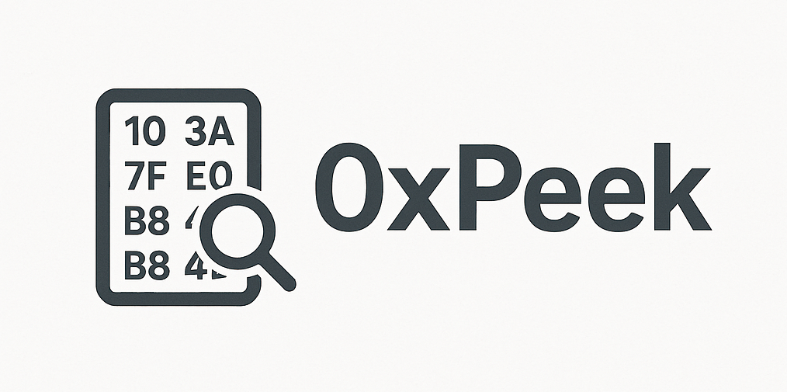

# 0xPeek


A simple terminal hex editor.



## Features

- **Magic byte detection** — identifies file type from header bytes (ELF, PE, Mach-O, ZIP, PDF, and hundreds more via `pyfsig`)
- **Shannon entropy analysis** — displays entropy of the full file (0–8 scale) to quickly spot encrypted, compressed, or packed regions
- **Hex + ASCII panes** — edit in either pane, toggle with `Tab`
- **Mouse drag selection** — click and drag to select a byte range, then copy as `\x`-style hex or ASCII
- **Theme support** — respects Textual's built-in themes (Nord, Gruvbox, Catppuccin Mocha, and more)
- **Save with choice** — overwrite the original or save a copy with a custom filename

## Installation

**From GitHub (recommended):**
```bash
pipx install git+https://github.com/BinaryBobcat/0xPeek.git
```

**From a cloned repo:**
```bash
git clone https://github.com/BinaryBobcat/0xPeek.git
cd 0xPeek
pipx install .
```

> `pipx` keeps the tool in an isolated environment. Install it with `brew install pipx` or `pip install pipx` if you don't have it.

## Usage

```bash
0xpeek <file>
```

## Interface

Picture

## Keybindings

| Key | Action |
|-----|--------|
| Arrow keys | Move cursor |
| `Tab` | Toggle hex / ASCII pane |
| `Page Up / Down` | Scroll by page |
| `Home / End` | Start / end of row |
| `Ctrl+Home / End` | Start / end of file |
| `Ctrl+S` | Save |
| `Ctrl+C` | Copy selection (or current byte) |
| `Ctrl+Q` | Quit |

## Editing

**Hex pane** — type two hex digits (`0–9`, `a–f`) to overwrite the byte under the cursor. The cursor advances automatically after each complete byte.

**ASCII pane** — type any printable character to overwrite the byte under the cursor.

Modified bytes are highlighted in red. The status bar shows `● MODIFIED` when there are unsaved changes.

## Saving

Press `Ctrl+S` to open the save prompt:

- **`O`** — overwrite the original file
- **`C`** — save a copy (prompts for filename, pre-filled as `filename_copy.ext`)
- **`Esc`** — cancel

## Copying

Click and drag to select a byte range. Selected bytes are highlighted in cyan across both panes. The status bar shows the selected range and byte count.

Press `Ctrl+C` to copy:

- **`H`** — copies as `\x`-style hex: `\x4d\x5a\x90\x00`
- **`A`** — copies as ASCII (non-printable bytes rendered as `\xNN`)
- **`Esc`** — cancel

If no selection exists, the current byte under the cursor is copied.

## Themes

0xPeek uses Textual's theme system. Switch themes via the command palette (`Ctrl+P` → search "theme") or set a default in your Textual configuration.

Available built-in themes include: `textual-dark`, `textual-light`, `nord`, `gruvbox`, `catppuccin-mocha`, and others.

## Requirements

- Python 3.10+
- [textual](https://github.com/Textualize/textual) >= 0.50.0
- [pyfsig](https://github.com/daddycocoaman/pyfsig)
